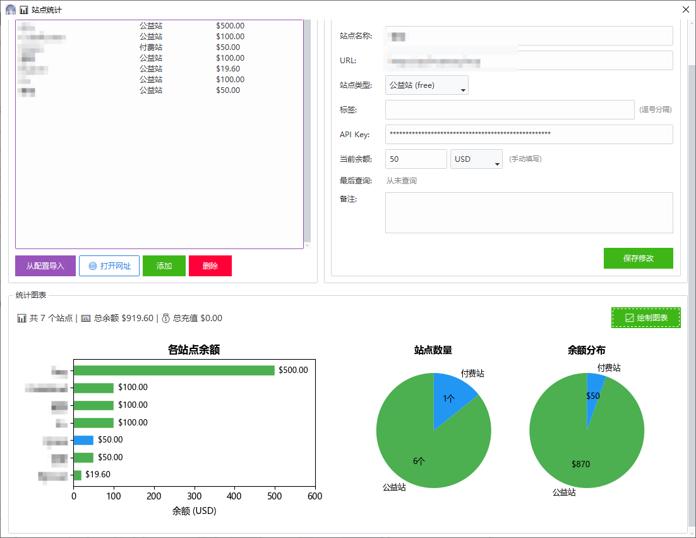
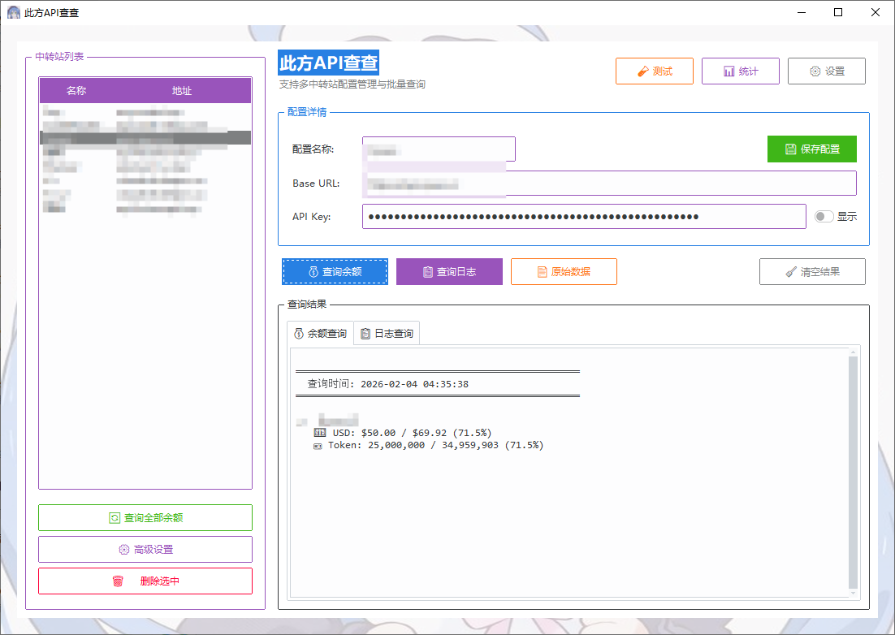
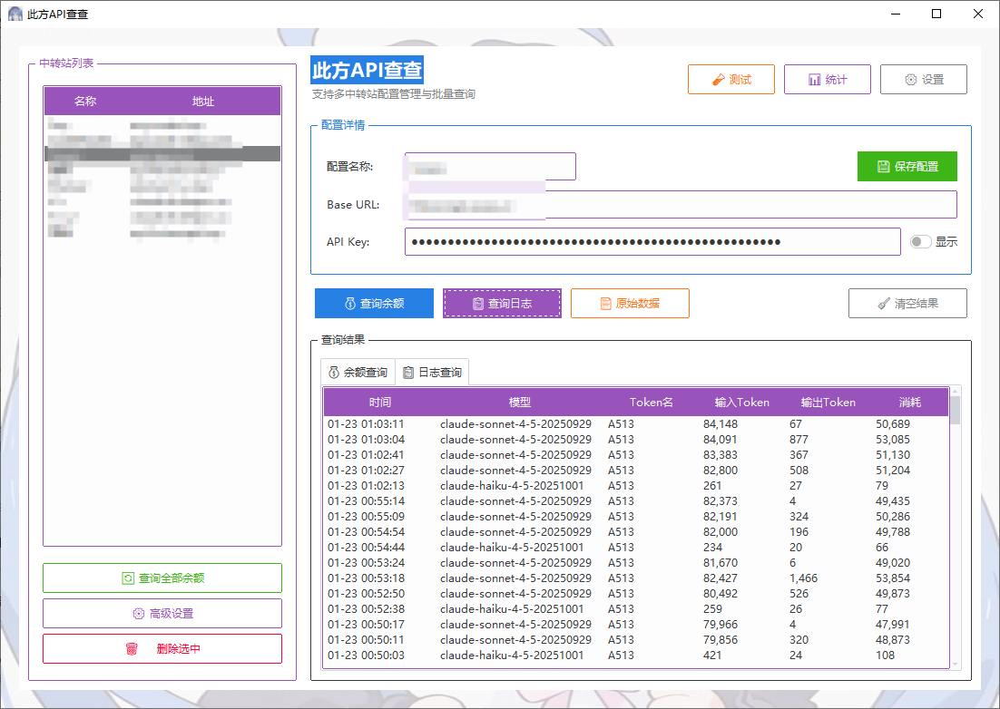
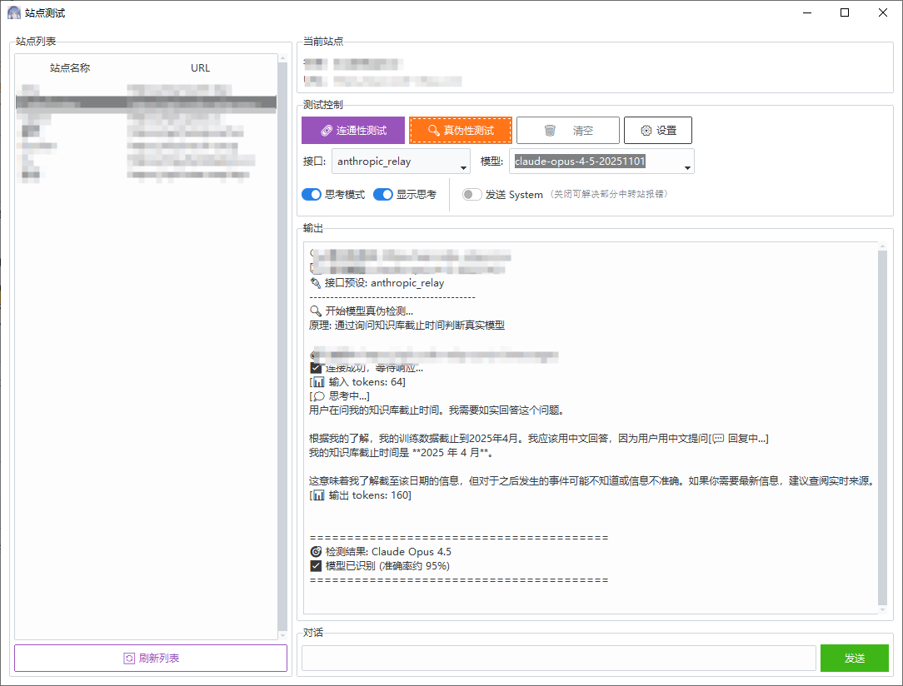

# KonataAPI - 此方API查查

一个用于查询 AI 中转站余额和调用日志的桌面工具。

## 功能特性

- 支持多中转站配置管理

- 查询账户余额（USD / Token 两种统计方式）

- 查询调用日志

- 批量查询所有配置的余额
- 自定义 API 接口路径
- **多种认证方式** - 支持 Bearer Token 和 URL Key 两种认证
- **多种 API 格式** - 自动检测 OpenAI、NewAPI、sub2api 等多种格式
- 按站点配置日志代理（解决部分站点限制）
- 查看原始 API 返回数据
- **系统托盘支持** - 最小化到托盘，右键菜单快捷操作
- **开机自启动** - 可选随 Windows 启动自动运行
- **自动批量查询** - 定时自动查询所有站点余额
- **站点统计模块** - 管理站点档案、手动记录余额、记录充值、统计消费
- **站点测试模块** - 连通性测试、Claude 真伪性检测、原生对话
  - **多种 API 预设** - 支持原生 Anthropic/OpenAI、中转站格式、Claude CLI 真实格式
  - **Claude CLI 真实格式** - 完全模拟 Claude Code CLI 请求，可绕过部分中转站验证
- **一键签到功能** - 配置签到网址，批量打开所有签到页面




## 界面布局

主界面采用**标签页切换**设计，左侧为全局站点列表，右侧分为三个功能标签页：

| 标签页 | 功能 | 说明 |
|--------|------|------|
| **📊 数据统计** | 站点档案管理 | 管理站点信息、记录充值、配置签到网址、查看统计图表 |
| **💰 余额查询** | 查询余额/日志 | 查询余额和调用日志，支持高级接口设置 |
| **🧪 站点测试** | 连通性/真伪性测试 | 测试站点连通性、检测模型真伪、原生对话 |

**使用流程：**
1. 在左侧「中转站列表」点击选择站点（或点击「➕ 添加站点」新建）
2. 站点信息自动同步到所有标签页
3. 在「📊 数据统计」中编辑站点详细信息
4. 切换标签页执行余额查询或站点测试

**左侧列表操作按钮：**
- **➕ 添加站点** - 新建站点，自动跳转到数据统计编辑
- **🔄 查询全部余额** - 批量查询所有站点余额
- **🎁 一键签到** - 打开所有配置了签到网址的站点
- **🗑️ 删除选中** - 删除当前选中的站点


## 数据架构

KonataAPI 使用两个配置文件分别管理不同类型的数据：

| 文件 | 用途 | 说明 |
|------|------|------|
| **stats.json** | 站点数据 | 站点列表主数据源，包含名称、URL、API Key、签到网址、统计数据等 |
| **config.json** | 全局设置 | API 端点配置、托盘设置、自动查询设置等应用级配置 |

> **注意**：站点管理统一在「📊 数据统计」模块中进行，左侧列表展示的是 stats.json 中的站点。


## 支持的 API 格式

KonataAPI 支持自动检测多种中转站 API 格式：

| 格式 | 余额接口 | 日志接口 | 认证方式 | 说明 |
|------|---------|---------|---------|------|
| **OpenAI 兼容** | `/v1/dashboard/billing/subscription` | - | Bearer sk-xxx | 大部分中转站默认格式 |
| **NewAPI / One-API** | `/api/usage/token/` | `/api/log/token` | Bearer sk-xxx | 国内常见中转站 |
| **sub2api** | `/v1/usage` | ❌ 不支持 | Bearer sk-xxx | Claude 订阅转 API |

### 自动检测顺序

程序会按以下顺序自动尝试不同的 API 格式：

1. **OpenAI 兼容格式** - `/v1/dashboard/billing/subscription`
2. **sub2api 格式** - `/v1/usage`（返回余额+用量统计）
3. **JWT Token 格式** - `/api/v1/auth/me`（需要登录态）
4. **NewAPI Token 格式** - `/api/usage/token/`

大多数情况下无需手动配置，程序会自动识别站点类型。

### sub2api 站点说明

基于 [sub2api](https://github.com/Wei-Shaw/sub2api) 的站点（如 Forward）：
- ✅ **余额查询**：支持，通过 `/v1/usage` 接口
- ❌ **日志查询**：不支持，sub2api 的日志接口需要 JWT Token（登录态）

## 安装

### 依赖

- Python 3.8+
- Windows（GUI 基于 tkinter）

### 安装步骤

```bash
# 克隆仓库
git clone https://github.com/your-username/KonataAPI.git
cd KonataAPI

# 安装依赖
pip install -r requirements.txt
```

## 使用方法

### 运行程序

```bash
python main.py
```

### 添加站点

1. 点击左侧「➕ 添加站点」按钮
2. 自动跳转到「📊 数据统计」标签页
3. 填写站点名称、Base URL、API Key 等信息
4. 点击「💾 保存修改」

### 一键签到

1. 在「📊 数据统计」标签页选择站点
2. 填写「签到网址」（如 `https://xxx.com/user/checkin`）
3. 点击「保存修改」
4. 点击左侧「🎁 一键签到」批量打开所有配置了签到网址的站点

### 高级接口设置

每个站点可以独立配置 API 接口路径和认证方式：

1. 选择站点后，在「💰 余额查询」标签页点击「⚙️ 高级设置」
2. 可配置的选项：
   - **余额查询认证方式** - Bearer Token 或 URL Key
   - **日志查询认证方式** - Bearer Token 或 URL Key
   - **日志代理地址** - 部分站点需要代理访问
   - **自定义接口路径** - 覆盖全局默认的 API 路径
3. 点击「保存」，设置将保存到站点数据中

### 日志代理（可选）

部分中转站的日志接口有访问限制，需要通过代理访问。可以在「高级设置」中为单个站点配置代理地址。

### 配置文件格式

#### 全局设置 - config.json

全局设置文件位于 `config/config.json`，格式如下：

```json
{
  "api_endpoints": {
    "balance_subscription": "/v1/dashboard/billing/subscription",
    "balance_usage": "/v1/dashboard/billing/usage",
    "logs": "/api/log/token",
    "logs_page_size": 50
  },
  "minimize_to_tray": true,
  "auto_query": {
    "enabled": false,
    "interval_minutes": 30
  },
  "low_balance_threshold": 10
}
```

字段说明：
- `api_endpoints` - 全局接口路径配置（可在设置中修改）
  - `balance_subscription` - 余额订阅接口路径
  - `balance_usage` - 用量统计接口路径
  - `logs` - 日志查询接口路径
  - `logs_page_size` - 日志每页数量
- `minimize_to_tray` - 关闭窗口时是否最小化到托盘
- `auto_query` - 自动查询设置
  - `enabled` - 是否启用自动查询
  - `interval_minutes` - 查询间隔（分钟）
- `low_balance_threshold` - 低余额警告阈值

#### 站点数据 - stats.json

站点数据文件位于 `config/stats.json`，这是站点列表的**主数据源**：

```json
{
  "sites": [
    {
      "id": "uuid-xxx-xxx",
      "name": "站点名称",
      "url": "https://api.example.com",
      "api_key": "sk-your-api-key",
      "type": "paid",
      "tags": ["claude", "gpt"],
      "balance": 100.0,
      "balance_unit": "USD",
      "checkin_url": "https://example.com/user/checkin",
      "notes": "备注信息",
      "balance_auth_type": "bearer",
      "log_auth_type": "url_key",
      "proxy": "",
      "endpoints": {
        "balance_subscription": "/v1/dashboard/billing/subscription",
        "balance_usage": "/v1/dashboard/billing/usage",
        "logs": "/api/log/token"
      },
      "recharge_records": [
        {
          "date": "2024-01-01",
          "amount": 50.0,
          "note": "首次充值"
        }
      ]
    }
  ]
}
```

字段说明：
- `id` - 站点唯一标识（UUID，自动生成）
- `name` - 站点名称
- `url` - API 基础地址
- `api_key` - API Key
- `type` - 站点类型（`paid` 付费 / `free` 免费）
- `tags` - 标签列表
- `balance` - 当前余额（手动记录）
- `balance_unit` - 余额单位
- `checkin_url` - 签到网址（用于一键签到）
- `notes` - 备注信息
- `balance_auth_type` - 余额查询认证方式（`bearer` / `url_key`）
- `log_auth_type` - 日志查询认证方式（`bearer` / `url_key`）
- `proxy` - 日志代理地址（可选）
- `endpoints` - 站点级别自定义接口路径（可选，覆盖全局设置）
- `recharge_records` - 充值记录列表

## 打包为可执行文件

### 方式一：使用 spec 文件（推荐）

```bash
pip install pyinstaller
pyinstaller KonataAPI.spec --clean
```

### 方式二：使用打包脚本

1. 编辑 `build.bat`，填写你的 Conda 路径和环境：
   ```bat
   set CONDA_PATH=
   set CONDA_ENV=
   ```

2. 双击运行 `build.bat`

3. 打包完成后，可执行文件位于 `dist/KonataAPI.exe`

## 项目结构

```
KonataAPI/
├── main.py                     # 入口文件
├── build.bat                   # 打包脚本
├── KonataAPI.spec              # PyInstaller 打包配置
├── src/
│   └── konata_api/
│       ├── __init__.py
│       ├── app.py              # GUI 主应用（标签页布局）
│       ├── dialogs.py          # 对话框组件
│       ├── tray.py             # 系统托盘模块
│       ├── utils.py            # 工具函数
│       ├── api.py              # API 查询逻辑
│       ├── api_presets.py      # API 接口预设配置
│       ├── stats.py            # 站点统计数据管理
│       ├── stats_dialog.py     # 站点统计模块（StatsFrame）
│       ├── conversation_test.py # Claude 真伪检测核心
│       ├── test_dialog.py      # 站点测试模块（TestFrame）
│       └── test_settings_dialog.py # 测试设置对话框
├── assets/
│   ├── icon.ico                # 程序图标
│   └── background.jpg          # 背景图片
├── config/
│   ├── config.example.json     # 配置文件示例
│   ├── cli_tools.json          # Claude CLI 工具定义（模型检测用）
│   ├── cli_system.json         # Claude CLI System Prompt（模型检测用）
│   └── stats.json              # 站点数据（主数据源，自动生成）
├── requirements.txt
├── README.md
└── .gitignore
```

## 感谢L站此方佬(@user2996)针对claude模型真假方法的分享，本项目根据 https://apikey.cifang.xyz/ 进行模仿与个人针对性更改。


## License

MIT
